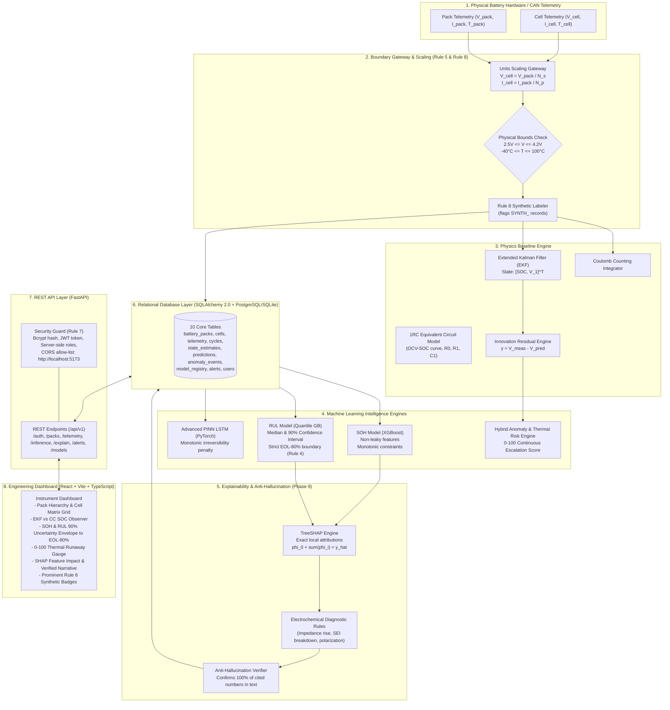
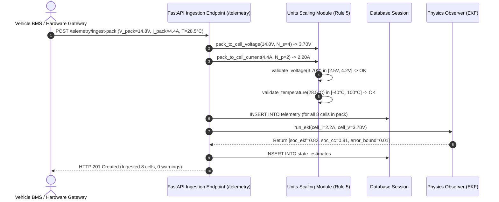
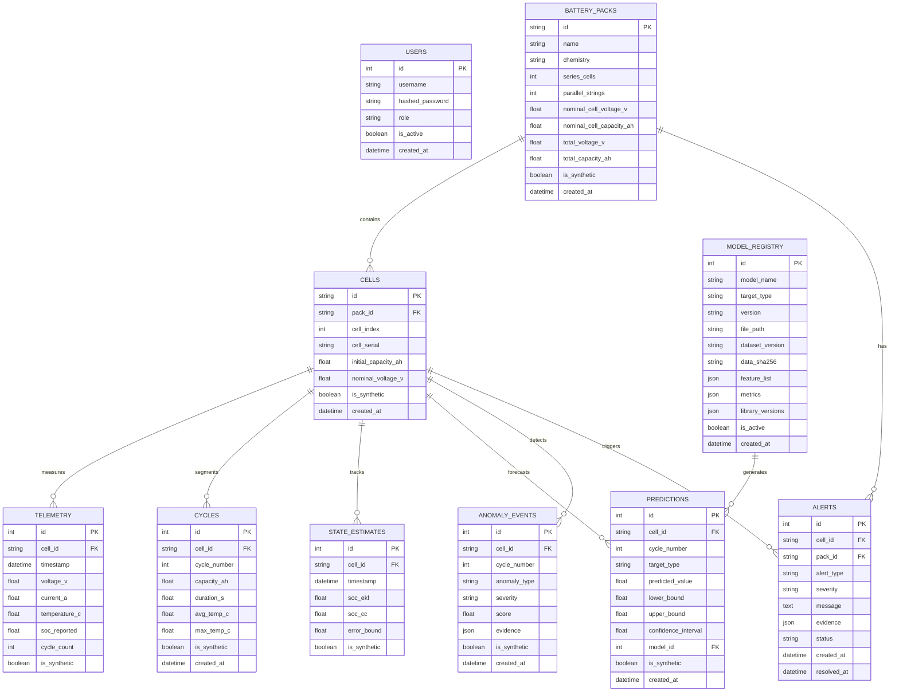

# System Architecture: EV Battery Intelligence Platform

The **EV Battery Intelligence Platform** is an automotive-grade decision-support system that extends conventional Battery Management Systems (BMS). It ingests high-frequency or segmented battery telemetry (terminal voltage, pack current, cell temperatures, cycle count) and produces a continuously updated digital representation of battery state, degradation trajectories, safety risks, and explainable diagnostics.

---

## 1. Core Engineering Paradigm: Hybrid Physics + Data-Driven

---

## 2. Ingestion & Physical Scaling Sequence (Rule 5)

---

## 3. Database Schema Entity-Relationship Diagram

---

## 4. Enforcement of the 10 Non-Negotiable Rules

| Rule | Requirement | Implementation & Architectural Enforcement |
|---|---|---|
| **1. No Data Leakage** | Group splits strictly by battery ID | Leave-One-Battery-Out (LOBO) cross-validation in `src/ev_battery/soh/evaluation.py` and `src/ev_battery/rul/evaluation.py`. Never random row split. |
| **2. No Target Leakage** | $\text{SOH} = C / C_0$. Capacity cannot be an input. | `validate_no_target_leakage()` in datasets, Pydantic field validators on API schemas, and unit test assertions that fail if `capacity` is supplied. |
| **3. Beat a Baseline** | Report against Predict-the-Mean & Linear models | Every evaluation computes `mean ± std across ALL folds` against mean & linear baselines in `baselines.py` and logs to `model_registry`. |
| **4. RUL Definition** | RUL = cycles until SOH $\le$ 80% (EOL) | Explicitly calculated in `src/ev_battery/rul/dataset.py` using `find_eol_cycle()`. Quantile gradient boosting predicts median and 90% confidence bands $[q_{0.05}, q_{0.95}]$. |
| **5. Units & Scale** | Cell models never receive pack values | Single units gateway (`src/ev_battery/units.py`). Pack telemetry is scaled via series cells ($N_s$) and parallel strings ($N_p$) with bounds checks ($[2.5\text{V}, 4.2\text{V}]$, $[-40^\circ\text{C}, 100^\circ\text{C}]$). |
| **6. Reproducible** | Pinned versions, fixed seeds, SHA256 hashes | Pinned dependencies in `requirements.txt` and `package-lock.json`. Every model stores SHA256 of training data, feature lists, library versions, and metrics in `model_registry`. |
| **7. Security** | No hardcoded secrets, server-side roles, CORS | Pydantic Settings fails at startup if `SECRET_KEY` missing. Passwords hashed with bcrypt. Roles loaded server-side from JWT tokens. CORS allow-list (`http://localhost:5173`). |
| **8. Synthetic Labelling** | Synthetic data clearly labelled everywhere | All tables store `is_synthetic: boolean`. File prefixes use `SYNTH_`. UI renders glowing amber `[SYNTHETIC DATA]` badges. |
| **9. Tests Everywhere** | 100% test pass required | Comprehensive test suite covering data, physics, ML, deep learning, backend, explainability, and E2E integration. |
| **10. Keep It Simple** | Direct connections, no redundant gateways | FastAPI talks directly to the database and serves the React dashboard without unnecessary BFF proxies. |
